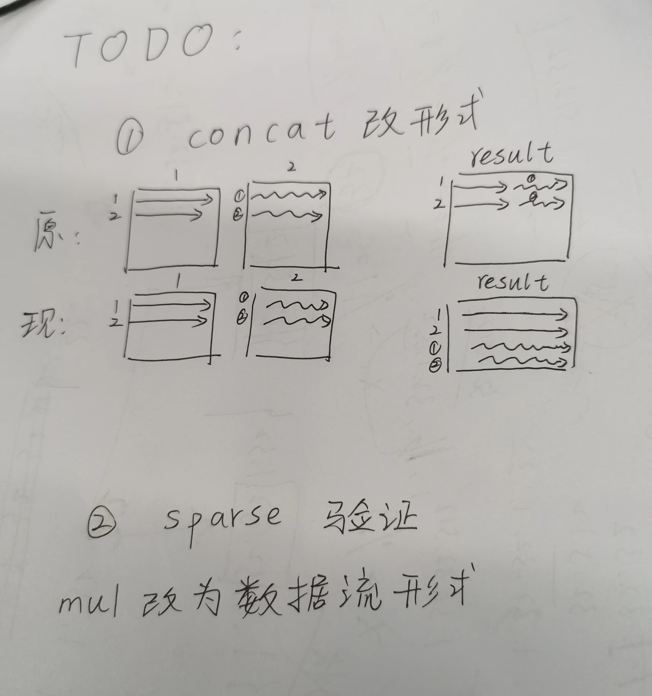
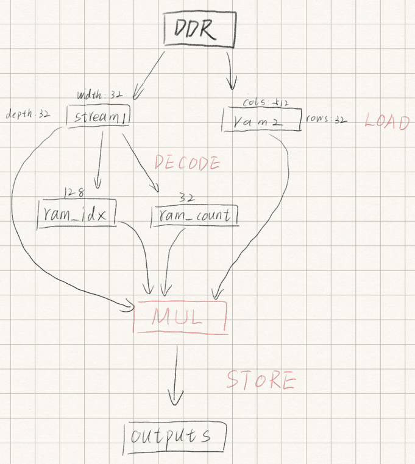
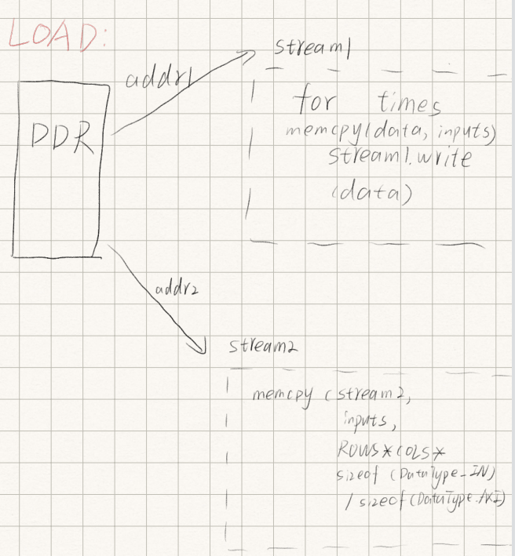
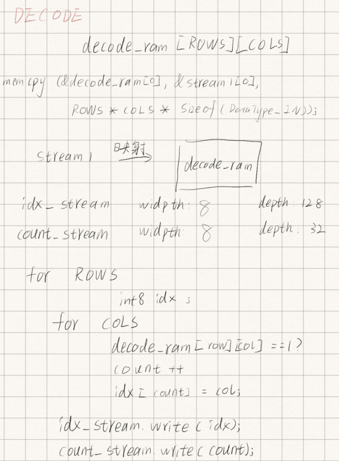
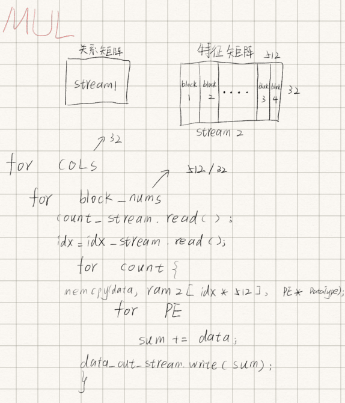

# **[Prediction_Model_Accelerator](https://github.com/YaoTengqi/Prediction_Model_Accelerator)**

## 进度

|         算子          |       日期       |   CSIM   |             RTL              | BOARD |
| :-------------------: | :--------------: | :------: | :--------------------------: | :---: |
|        Concat         | 5.27新增量化操作 | **done** |           **done**           |   /   |
|        Sparse         | 5.29新增量化操作 | **done** | **5.30新增量化操作通过测试** |   /   |
| ~~Reshape~~(目前弃用) |        /         |   done   |              /               |   /   |

## TODO:

**5.21**



## Concat

```cpp
void concat(
		uint32_t input_data_addr1,
		uint32_t input_data_addr2,
		uint32_t output_data_addr3,
		t_AXI_DataType *inputs,
		t_AXI_DataType *outputs);
```

### 1. 原理 

按列拼起来

连接前： Tensor 1:

 [[1 2]

 [3 4]] 	

Tensor 2: 

[[5 6] 

[7 8]] 

连接后： 

Concatenated Tensor: 

[[1 2 5 6] 

[3 4 7 8]]

### 2. 硬件实现 

| 输入/输出      | 解释                                                         |
| -------------- | ------------------------------------------------------------ |
| 输入：inputs   | DDR的输入数据，为两个要进行concat操作的tensor数据            |
| 输入：addr1    | tensor1在DDR中的地址                                         |
| 输入：addr2    | tensor2在DDR中的地址                                         |
| 输入：addr3    | concat操作完成后将新的数据存回的地址                         |
|                | 操作：将两块地址存储的数据取出后，**按列拼接**(如1.原理所示)拼接并存回addr3完成concat操作 |
| 输出： outputs |                                                              |

### 3. 函数设计

| 函数名                                                       | 返回值 | 解释                                                         | 日期      |
| :----------------------------------------------------------- | :----- | :----------------------------------------------------------- | :-------- |
| void read_inputs(t_AXI_DataType *inputs,<br/>				 uint32_t input_data_addr1,<br/>				 uint32_t input_data_addr2,<br/>				 unsigned int ROWS,<br/>				 unsigned int COLS,<br/>				 hls::stream<WideType<t_DataType_IN, sizeof(t_AXI_DataType) / sizeof(t_DataType_IN)>> &input_stream<br/>				 ) | /      | 将数据从DRR中读出来，其中ram1从addr1读出；ram2从addr2读出；分别读出后依次拼接到outputs中 |           |
| void requant(hls::stream<WideType<t_DataType_IN, sizeof(t_AXI_DataType) / sizeof(t_DataType_IN)>> &input_stream,<br/>			 unsigned int ROWS,<br/>			 unsigned int COLS,<br/>			 hls::stream<WideType<t_DataType_OUT, sizeof(t_AXI_DataType) / sizeof(t_DataType_OUT)>> &output_stream<br/>			 ) | /      | 新增的量化函数，对concat的数据进行再量化                     | 2024.5.27 |
| void store(  unsigned int ROWS,<br/>			 unsigned int COLS,<br/>			 uint32_t input_data_addr3,<br/>			 hls::stream<WideType<t_DataType_OUT, sizeof(t_AXI_DataType) / sizeof(t_DataType_OUT)>> &output_stream,<br/>			 t_AXI_DataType *outputs<br/>			 ) | /      | 将read_inputs()写好的data_stream数据流在此函数中按行取出(有对应的数据位宽**t_OUT_ROW_DataType**)，存入临时buffer中后再用memcpy将数据从临时buffer存入outputs[addr3]中，其中addr3为起始地址 |           |

### 4.C仿真问题

| 问题                                           | 解决方法                                                     | 日期      |
| ---------------------------------------------- | ------------------------------------------------------------ | --------- |
| **params.hpp**中的**t_ROW_DataType**该如何计算 | ``#define INP_ROW_DATA_WIDTH COLS * INP_DATA_WIDTH	// 一行输入数据占的位宽``<br/>``#define OUT_ROW_DATA_WIDTH INP_ROW_DATA_WIDTH * 2   // 一行输出数据占的位宽`` |           |
| **把ROWS COLS也改为从AXI_LITE传来**            | ~~**待解决:** 根据**PE**对流进行分割~~ **done**              |           |
| 改为数据流的形式                               | **修改前为23.425us**，修改后为22us变化不大                   | 2024.5.27 |

### 5.RTL仿真

RTL仿真问题

| 问题                                                         | 解决方法                                          |
| ------------------------------------------------------------ | ------------------------------------------------- |
| 现在可以从DDR正常取出数据RDATA正确                           |                                                   |
| data_concat1与data_concat2取出的数据不对，计算的结果data_out也不对 | ~~初步怀疑是地址问题？~~ **done**是代码的逻辑问题 |


## ~~Reshape~~(2024.5.14弃用)

```cpp
void reshape(
		uint32_t data_addr,
		t_AXI_DataType *inputs,
		t_AXI_DataType *outputs);
```

### 1. 原理 

将矩阵进行转置

Tensor：

[[1 2]

[3 4]

[5 6]] 	

reshape后： 

Reshape Tensor: 

[[1 3 5 7] 

[2 4 6 8]]

### 2. 硬件实现 

| 输入/输出    | 解释                                                         |
| ------------ | ------------------------------------------------------------ |
| 输入：inputs | DDR的输入数据，为要进行reshape操作的tensor数据               |
| 输入：addr   | tensor在DDR中的地址,也是要写回的地址                         |
|              | 操作：将数据按行取出后，按列拼接起来形成一个新的矩阵完成转置reshape |

### 3. 函数设计

| 函数名                                                       | 返回值 | 解释                                                         |
| ------------------------------------------------------------ | ------ | ------------------------------------------------------------ |
| void read_inputs(t_AXI_DataType *inputs,<br/>				 uint32_t input_data_addr1,<br/>				 uint32_t input_data_addr2,<br/>				 uint32_t input_data_addr3,<br/>				 unsigned int ROWS,<br/>				 unsigned int COLS,<br/>				 t_AXI_DataType *outputs,<br/>				 bool &concat_flag) | /      | 将inputs中的数据按列进行循环，每次取这一列的每一行的数据，每个数据大小类型为int8，拼成``WideType<t_DataType_Item, ROWS> ``大小后写入流中完成reshape |
| ~~template<typename t_AXI_DataType, typename t_OUT_ROW_DataType, uint32_t ROWS, uint32_t COLS><br/>void **store**(hls::stream<t_OUT_ROW_DataType> &data_stream_out,t_AXI_DataType *outputs,unsigned int output_data_addr)~~ | /      | 将数据流中的数据存回DDR，存回的地址为原地址addr              |
| void requant(t_AXI_DataType *outputs,<br/>			 unsigned int ROWS,<br/>			 unsigned int COLS,<br/>			 uint32_t input_data_addr1,<br/>			 uint32_t input_data_addr2<br/>			 ) | /      | 将结果分块进行requant操作，使其输出类型一致                  |

### 4. 问题

| 问题                 | 解决方法 |
| -------------------- | -------- |
| 使用**traspose.hpp** |          |


## Sparse

```cpp
void sparse(
	uint32_t input_data_addr1,
	uint32_t input_data_addr2,
	uint32_t output_data_addr3,
	unsigned int am_ROWS,
	unsigned int am_COLS,
	unsigned int fm_ROWS,
	unsigned int fm_COLS,
	t_AXI_DataType *inputs,
	t_AXI_DataType *outputs,
	bool &sparse_flag);
```

### 1. 原理 

将**邻接矩阵**与**特征矩阵**相乘

**邻接矩阵(32*32)：**

[[0 0 0 ... 0 0 0]
 [1 0 0 ... 1 0 0]
 [0 0 0 ... 0 0 0]
 ...
 [0 0 0 ... 0 1 0]
 [0 0 0 ... 0 0 0]
 [0 0 0 ... 0 0 0]]	

**特征矩阵(32*512):** 

[[-7 -2 -3 ... -2 -7 -6]
 [-2 -4 -5 ...  0 -8 -3]
 [-1 -5 -5 ... -1 -6 -3]
 ...
 [-3 -1 -3 ... -2 -3 -5]
 [-5 -6 -2 ... -1 -7 -3]
 [-7 -1 -7 ...  0 -1 -7]]

**计算结果(32*512):**

[[ -1  -7  -8 ...   0  -4  -1]
 [-19 -19 -15 ... -16 -24 -22]
 [ -6  -1  -2 ...  -5   0  -8]
 ...
 [-16 -12  -7 ... -12 -15 -15]
 [ -3 -15  -8 ...  -8  -6  -5]
 [  0   0   0 ...   0   0   0]]











### 2. 硬件实现 

| 输入/输出 | 解释                                            |
| --------- | ----------------------------------------------- |
| inputs    | DDR的输入数据，为要进行sparse操作的两个矩阵数据 |
| addr1     | 邻接矩阵am的addr                                |
| addr2     | 特征矩阵fm的addr                                |
| addr3     | 输出矩阵outputs的addr                           |

### 3. 函数设计

| 函数名                                                       | 返回值 | 解释                                                         |
| ------------------------------------------------------------ | ------ | ------------------------------------------------------------ |
| void load(<br/>	unsigned int am_ROWS,<br/>	unsigned int am_COLS,<br/>	unsigned int fm_ROWS,<br/>	unsigned int fm_COLS,<br/>	t_AXI_DataType *inputs,<br/>	hls::stream<uint8_t> &idx_stream,<br/>	hls::stream<uint8_t> &count_stream,<br/>	hls::stream<typename WideType<t_DataType_IN, nPE>::t_TypeInt> &fm_stream,<br/>	uint32_t input_data_addr1,<br/>	uint32_t input_data_addr2) | /      | 1.特征矩阵fm将以ram[][\]的形式从inputs中接受数据;<br/>**2.根据邻接矩阵am得出哪一列不为0，并计数count，处理完邻接矩阵am的一行后将count写入count_ram，并将处理好的idx(哪一列数据不为0)写入idx_ram**<br/>**3.把ram的大小都定好，防止编译成AXI_LITE接口，需要AXI接口**<br/>4.将fm_ram的数据位宽改为和PE位宽相同，这样一次可以读出整个PE的数据，提高计算效率(5.22)，并改为数据流的格式使其通过RTL仿真 |
| ~~void **decode**(hls::stream<typename WideType<t_DataType_IN, nPE>::t_TypeInt> &data_stream_am, hls::stream<typename WideType<uint8_t, 128>::t_TypeInt> &idx_stream, hls::stream<typename WideType<uint8_t, 32>::t_TypeInt> &count_stream, unsigned int am_ROWS,unsigned int am_COLS)~~ | /      | ~~根据邻接矩阵am得出哪一列不为0，并计数count，处理完邻接矩阵am的一行后将count写入count_stream，并将处理好的idx(哪一列数据不为0)写入idx_stream~~ |
| void mul(<br/>	unsigned int am_ROWS,<br/>	unsigned int am_COLS,<br/>	unsigned int fm_ROWS,<br/>	unsigned int fm_COLS,<br/>	hls::stream<typename WideType<t_DataType_OUT, nPE>::t_TypeInt> &fm_stream,<br/>	hls::stream<uint8_t> &idx_stream,<br/>	hls::stream<uint8_t> &count_stream,<br/>	hls::stream<typename WideType<t_Quant_DataType, nPE>::t_TypeInt> &data_stream_out) | /      | 共四层循环最外层(1st.)为循环ROWS(结果的行数为32)；第2nd.层循环为分为了几块(fm_COLS/PE = 512/32);第3rd.层为这一行有几个不为0的数据(count数)；最后一层(4th.)为PE的大小(为32)，取相应的result_ram[i\][j] += ram[idx][pe\].<br/>data_out_stream在第3rd.层写入``result(data_out_stream.write(result))``<br/>~~用result_ram来存储中间结果，最后直接``memcpy``到outputs中，省去了``store``函数~~(不如用数据流的形式效果好，**数据流形式可以并行计算**) |
| void quant(hls::stream<typename WideType<t_Quant_DataType, nPE>::t_TypeInt> &data_stream_out,<br/>			unsigned int fm_ROWS,<br/>			unsigned int fm_COLS,<br/>			hls::stream<typename WideType<t_DataType_OUT, nPE>::t_TypeInt> &requant_stream_out,<br/>			int quant_shift,<br/>			int quant_mul<br/>			) | /      | 新加的量化操作，完成对数据的量化提升结果精度                 |
| void store(<br/>	hls::stream<typename WideType<t_DataType_OUT, nPE>::t_TypeInt> &data_stream_out,<br/>	t_AXI_DataType *outputs,<br/>	uint32_t output_data_addr3,<br/>	unsigned int ROWS,<br/>	unsigned int COLS,<br/>	bool &done_flag) | /      | 将写好的data_stream数据流在此函数中按行取出(有对应的数据位宽**t_OUT_ROW_DataType**)，用memcpy将数据从临时buffer存入outputs[addr3]中，其中addr3为起始地址 |

### 4. 问题

| 问题                                    | 解决方法             |
| --------------------------------------- | -------------------- |
| 直接从inputs取出并写入fm_stream         | 时间：3.517ms        |
| 从inpus放入RAM后在写入fm_stream         | 时间：**0.368ms!!!** |
| 结论：先放入RAM再写入流中会快10倍左右！ |                      |
